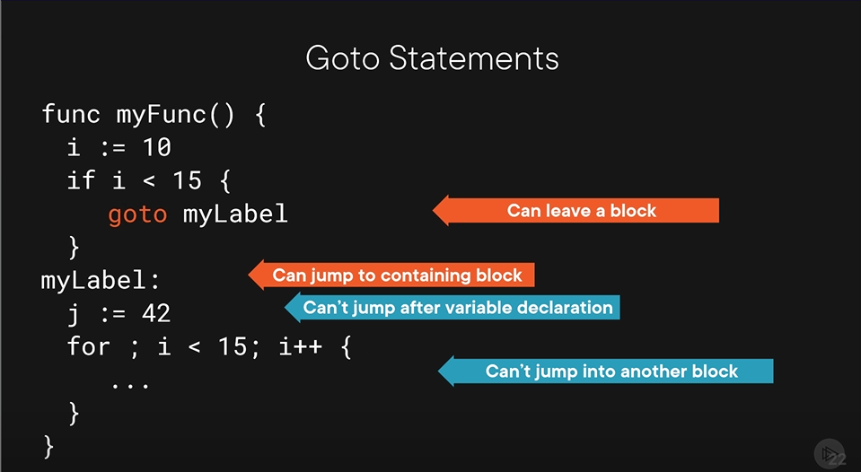
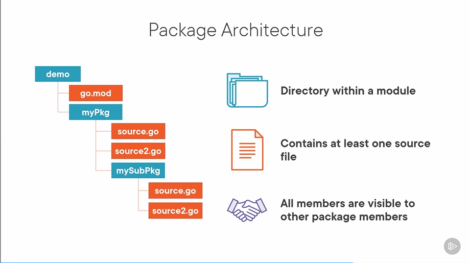

# Leveraging the Go Ecosystem

- Development Tools
  - Neovim
    - lsp: gopls
    - dap: nvim-dap-go
- Common Frameworks
    - Network Services
        - Go kit           [Comprehensive microservice framework]
        - Gin              [fast, lightweight web framework]
        - Gorilla Toolkit  [collection of useful without framework lock-in]
    - CLIs
        - Cobra            [framework for building command-line interface applications]
        - Standard library [zero dependency APIs for managing simple CLIs]
    - Cloud Infrastructure
        - Docker           [containerize applications to simplify deployment]
        - Kubernetes       [system that builds, deploys, and scales containerized apps]
        - Terraform        [cloud infrastructure management platform]
- Community Resources
    - go.dev
    - Learning Resources
    - Online Community
    - Conferences

# Go Fundamentals

- Toolkit
    - Build
    - Test
    - Documentation
    - Dependencies
    - Profile
    - Tracing
    - Manage code
- Tools
    - gotests: generate unit tests
    - gomodifytags: modify tags on structs
    - impl: sutbs for interfaces
    - goplay: the go playground
    - Installed
        - dlv: go debugger (delve)
        - staticcheck: linter
        - gopls: lsp from google
- [HTTP Fundamentals](https://app.pluralsight.com/library/courses/xhttp-fund)
- [Creating Web Services with Go 1](https://app.pluralsight.com/library/courses/creating-web-services)

## Data Types

- String
    - interpreted ("")
    - raw         (\`\`)
- Numbers
    - integers           (int)
    - unsigned intergers (uint)
    - float              (float32, float64)
    - complex            (complex64, complex128)
- Boolean
- Error
- All builtin types: pkg.go.dev/std
- Variables
    - var myName string          // declare variable
    - var myName string = "Mike" // declare and initialize
    - var myName = "Mike"        // initialize with inferred type
    - myName := "Mike"           // short declaration syntax
- Type Conversions
    ```
    var i int = 32
    var f float32
    f = i          // error! - Go doesn't support implicit conversions
    f = float32(i) // type conversions allow explicit conversion
    ```
- Arithmetic
    ```
    a, b := 10, 5  // Go allows multiple variables to be initialized at once!
    c := a + b     // 15 - addtion
    c := a - b     // 5  - subtraction
    c := a * b     // 50 - multiplication
    c := a / b     // 3  - division
    c := a % b     // 1  - modulus
    d := 7.0 % 2.0 // 3.5  - decimal results given for floating point numbers
    ```
- Comparisons
    ```
    a, b := 10, 5
    c := a == b // false - equality
    c = a != b  // true  - inequality
    c = a < b   // false - less than
    c = a <= b  // false - less than or equal
    c = a > b   // true  - greater
    c = a >= b  // true  - greater than or equal
    ```
- Constants
    ```
    const a = 42                   // implicitly typed constant
    const b string = "hello world" // explicitly typed constant
    const c = a                    // one constant can be assigned to another
    const (                        // group of constants
        d = true
        e = 3.14
    )
    const (
        a = "foo"
        b                      // unsassigned constants receive previous value
    )
    const c = 2 * 5            // 10 constant expression
    const d = "hello "+"world" // must be calculable at compile time
    const e = someFunction()   // this won't work - can't be evaluated at compile time

    const a = iota // 0 iota is related to position in constant group
    const (
        b = iota     // 0 iota starts at zero on first line
        c            // 1 constant expression copied, iota increments
        d = 3 * iota // 6 iota increments again
    )
    const (
        e = iota // iota resets to zero with each group
    )
    ```
- Pointers
    - Pointers are primarily used to share memory. Use copies whenever possible.
    ```
    a := "foo"   // create a string variable
    b := &a      // address operator returns the address of a variable
    *b = "bar"   // dereference a pointer with asterisk
    c = new(int) // built-in "new" function creates pointer to anonymous variable
    ```
- Arrays
    ```
    var arr [3]int        // array of 3 ints
    fmt.Println(arr)      // [0 0 0]
    arr = [3]int{1, 2, 3} // array literal
    fmt.Println(arr[1])   // 2
    arr[1] == 99          // update value
    fmt.Println(arr)      // [1 99 3]
    fmt.Println(len(arr)) // 3
    ```
    ```
    arr := [3]string{"foo", "bar", "baz"}

    arr2 := arr        // arrays are copied by value
    fmt.Println(arr2)  // {"foo" "bar" "baz"}

    arr[0] = "quux"
    fmt.Println(arr)   // {"quux" "bar" "baz"}
    fmt.Println(arr2)  // {"foo" "bar" "baz"}

    arr == arr2        // false - arrays are comparable
    ```
- Slices
    ```
    var s []int         // slices of ints
    fmt.Println(s)      // [] (nil)
    s = []int{1, 2, 3}  // slice literal
    s2 = []int{1, 2, 3} // slice literal

    fmt.Println(s[1]) // 2
    s[1] = 99         // update value
    fmt.Println(s)    // [1 99 3]

    s = append(s, 5, 10, 15) // add elements to the slice
    fmt.Println(s)           // [1 99 3 5 10 15]

    s = slices.Delete(s, 1, 3) // remove indices 1, 2 from slice (golang.org/x/exp/slices)
    fmt.Println(s)             // [1 5 10 15]

    s == s2 // compile time error - slices are not comparable
    ```
- Maps
    - [maps](https://pkg.go.dev/golang/org/x/exp/maps)
    ```
    var m map[string]int                  // declare a map
    fmt.Println(m)                        // map[] (nil)
    m = map[string]int{"foo":1 , "bar":2} // map literal
    fmt.Println(m)                        // map[foo:1 bar:2]

    fmt.Println(m["foo"]) // lookup value in map
    m["bar"] = 99         // update value in map

    delete(m, "foo") // remove entry from map
    m["baz"] = 418   // add value to map

    fmt.Println(m) // map[bar:99 baz:418]

    fmt.Println(m["foo"]) // 0 - queries always return results
    v, ok := m["foo"]     // comma okay syntax verifies presents
    fmt.Println(v, ok)    // 0, false
    ```
    ```
    m := map[string]int{
        "foo":1,
        "bar":2,
        "baz":3
    }
    m2 := m // maps are copied by reference
            // use maps.Clone to clone

    m["foo"], m2["bar"] = 99, 42 // update values in maps
    fmt.Println(m)               // map[foo:99 bar:42 baz:3]
    fmt.Println(m2)              // map[foo:99 bar:42 baz:3]
                                 // data is shared

    m == m2 // compile time error - maps are not comparable
    ```
- Structs
    ```
    var s struct{       // declare an anonymous struct
        name string
        id int
    }
    fmt.Println(s)      // {"" 0}
    s.name = "Arthur"   // assign value to field
    fmt.Println(s.name) // query value of field

    type myStruct struct{ // create custom type based on struct
        name string
        id int
    }
    var s myStruct        // decoare variable with custom type
    fmt.Println(s)        // {"" 0}
    s = myStruct{         // struct literal
        name: "Arthur",
        id:42,
    }
    fmt.Println(s)        // {"Arthur" 42}

    s2 := s
    s.name = "Tricia"  // structs are copied by value
    fmt.Println(s, s2) // {"Tricia" 42} {"Arthur" 42}

    s == s2 // false - structs are comparable
    ```

## Looping

- Basic Loops
    ```
    for { ... }                                // infinite loop
    for condition { ... }                      // loop till condition
    for initializer; test; post clause { ... } // counter-based loop
    ```
    ```
    // infinite loop
    i := 1
    for {
        fmt.Println(i)
        i += 1
    }
    ```
    ```
    // loop till condition
    i := 1
    for i < 3{
        fmt.Println(i)
        i += 1
    }
    ```
    ```
    // counter-based loop
    for i:=1; i < 3; i++{
        fmt.Println(i)
    }
    ```
- Looping Over Collections
    - Collections = {array, slice, maps}
    ```
    for key, value := range collection { ... }
    for key := range collection { ... }
    for _, value := range collection { ... }
    ```
    ```
    arr := [3]int{101, 102, 103}
    for i, v := range arr {
        fmt.Println(i, v)
    }
    fmt.Println("Done!")
    ```

## Branching

- If Statements
    ```
    if test { ... }
    if test { ... } else { ... }
    if test { ... } else if test { ... }
    if initializer; test { ... }
    ```
- Switch Statements
    ```
    switch test expression {
        case expression1:
            statements
        case expression2, expression3:
            statements
        default:
            statements
    }
    ```
    - Logical Switch
    ```
    // if you ommit "true" go will imply true
    switch i := 8; true {
        case i < 5:
            statement
        case i < 10:
            statement
        default:
            statement
    }
    ```
- Deferred Functions
    ```
    func main(){
        fmt.Println("main 1")
        defer fmt.Println("defer 1")
        fmt.Println("main 2")
        defer fmt.Println("defer 2")
    }
    Output:
        main 1
        main 2
        defer 2
        defer 1
    ```
    ```
    func main(){
        db, _ := sql.Open("driverName", "connection string")
        defer db.Close()
        rows, _ := db.Query("some sql query here")
        defer rows.Close()
    }
    ```
- Panic and Recover
    ```
    func main(){
        fmt.Println("main 1")
        func1()
        fmt.Println("main 2")
    }
    func func1(){
        defer func(){
            fmt.Println(recover())
        }()
        fmt.Println("func1 1")
        panic("uh-oh")
        fmt.Println("func2 2")
    }
    ```
- Goto Statements


## Organizing Programs

- Functions
    - Function signatures
        ```
        func functionName(parameters)(return values){
            function body
        }
        ```
    - Parameters and arguments
        ```
        func greet(name1 string, name2 string){
            function body
        }
        ```
        ```
        func greet(name1, name2 string){
            function body
        }
        ```
        ```
        func greet(names ...string){
            for _, n := range names {
                fmt.Println(n)
            }
        }
        ```
        ```
        func main(){
            name, otherName := "Name", "Other name"
            fmt.Println(name)
            fmt.Println(otherName)
            myFunc(name, &otherName)
            fmt.Println(name)
            fmt.Println(otherName)
        }
        func myFunc(name string, otherName *string){
            name = "New name"
            *otherName = "Other new name"
        }
        ```
    - Returning values
        ```
        func main() {
            result := add(1, 2)
            fmt.Println(result)

            result, ok = divide(1, 2)
            if ok {
                fmt.Println(result)
            }
        }
        func add(l, r int) int {
            return l + r
        }
        func divide(l, r int) (int, bool) {
            if r == 0 {
                return 0, false
            }
            return l/r, true
        }
        func divide(l, r int) (result int, ok bool) { // rarely used
            if r == 0 {
                return // 0, false
            }
            result = l/r
            ok = true
            return
            // optional: return 1/r, true
        }
        ```
- Packages - use cheat sheet for documentation

- Comments
    - `// this is a single line comment`
    - `var i int // single line comments can be added at the end of a line`
    ```
    /*
    this is a multi line comment
    */
    ```
    ```
    // Package user provides functionality for managing
    // users and their access rights.
    package user

    import "strings"

    var currentUsers []*User

    // MaxUsers controls how many users the system can handle at once.
    const MaxUsers = 100

    // GetById searches for users by their employee number.
    func GetById(id int) (User, bool) {}
    ```

## Object Orientation and Polymorphism

- Methods
    - Function vs Methods
    ```
    // function
    var i int

    func isEven(i int) bool {
        return i%2 == 0
    }

    // method
    type myInt int                 // need a type to bind method to
                                   // DOESN'T HAVE TO BE A STRUCT
    func (i myInt) isEven() bool { // method receiver
        return int(i)%2 == 0
    }
    var mi myInt
    ans = mi.isEven()
    ```
    - Method Receivers
    ```
    type user struct {
        id       int
        username string
    }

    // value receiver
    func (u user) String() string {
        return fmt.Sprintf("%v (%v)\n", u.username, u.id)
    }

    // pointer receiver
    func (u *user) UpdateName(n name) {
        u.username = name
    }
    ```
- Interfaces
    ```
    type Reader interface {
        Read([]byte) (int, error)
    }

    type File struct { ... }
    func (f File) Read(b []byte) (n int, err error)

    type TCPConn struct { ... }
    func (t TCPConn) Read(b []byte) (n int, err error)

    var f File
    var t TCPConn

    var r Reader
    r = f
    r.Read(...) // read from File
    r = t
    r.Read(...) // read from TCPConn
    ```
    - Type Assertions
    ```
    var f2 File = r    // error, Go can't be sure this will work
    f2 = r.(File)      // type assertion, panics upon failure
    f2, ok := r.(File) // type assertion with comma okay, doesn't panic
    ```
    - Type Switches
    ```
    var f File
    var r Reader = f

    switch v := r.(type) {
        case File:
            // v is now a File object
        case TCPConn:
            // v is now a TCPConn object
        default:
            // this is selected if no types were matched
    }
    ```
- Generic Programming
    ```
    func foo[T any](){ ... }        // create a function with a generic parameter 'T'
    func bar[T any, S any](){ ... } // can use multiple generic types per function
    func baz[T any](in T) T{        // generics maintain type from consumer's perpective
        return in
    }

    fmt.Println("%T", baz(3))    // int
    fmt.Println("%T", baz(true)) // bool

    any        // matches any type, like interface{}
    comparable // matches types that can be compared

    // create a type interface
    type Addable interface {
        int | float64
    }
    func add[T Addable](){ ... } // used like other types as generic parameter
    ```
    - Useful Packages
        - [constraints](https://golang.org/x/exp/constraints)
        - [slices](https://golang.org/x/exp/slices)
        - [maps](https://golang.org/x/exp/maps)
